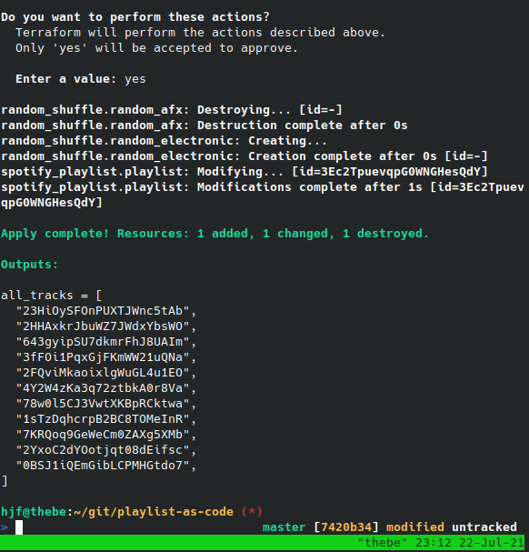
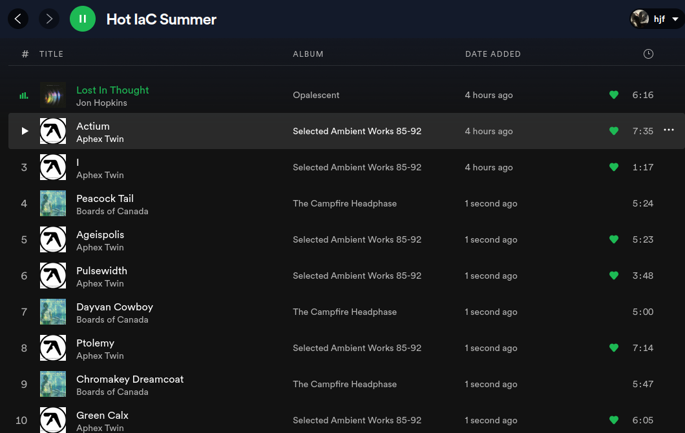

# Hot IaC Summer

Spotify playlist, as code.

Generates a playlist with some random electronic music for coding.

Based on [this guide](https://learn.hashicorp.com/tutorials/terraform/spotify-playlist). Give me a free t-shirt!

## Pre-requisites

* [Docker](https://www.digitalocean.com/community/tutorials/how-to-install-and-use-docker-on-ubuntu-18-04)
* [Terraform](https://learn.hashicorp.com/tutorials/terraform/install-cli)
* Git

## Usage

1. Follow [guide](https://www.digitalocean.com/community/tutorials/how-to-install-and-use-docker-on-ubuntu-18-04) and setup a spotify app on [developer.spotify.com](https://developer.spotify.com). You'll want to `cp .env.sample .env` and fill in the details.
2. Run `init.sh`. This starts a server as well as configuring some additional environment variables. Go to the 'auth' URL. 
3. You'll get a APIKey in the console. `cp terraform.tfvars.sample terraform.tfvars` and update the string.
4. Initialise Terraform:  `tf init`.
5. Create your playlist! `tf apply`.
6. ???
7. Give me your free Terraform t-shirt.
8. Profit. For me.

